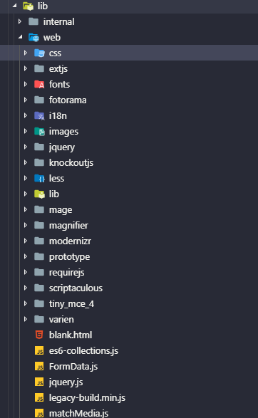
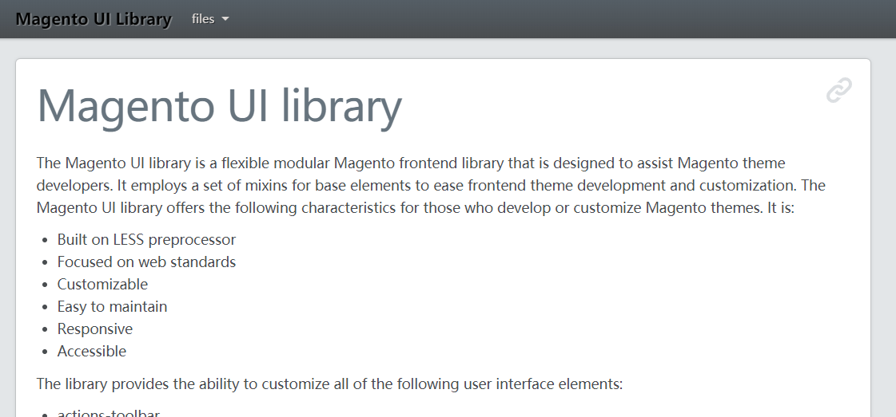
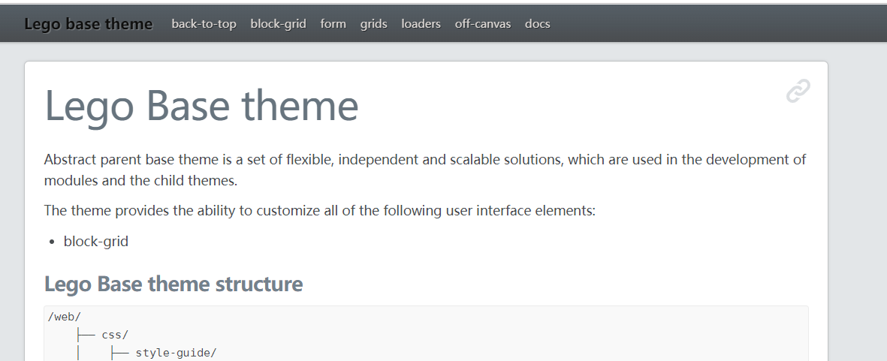
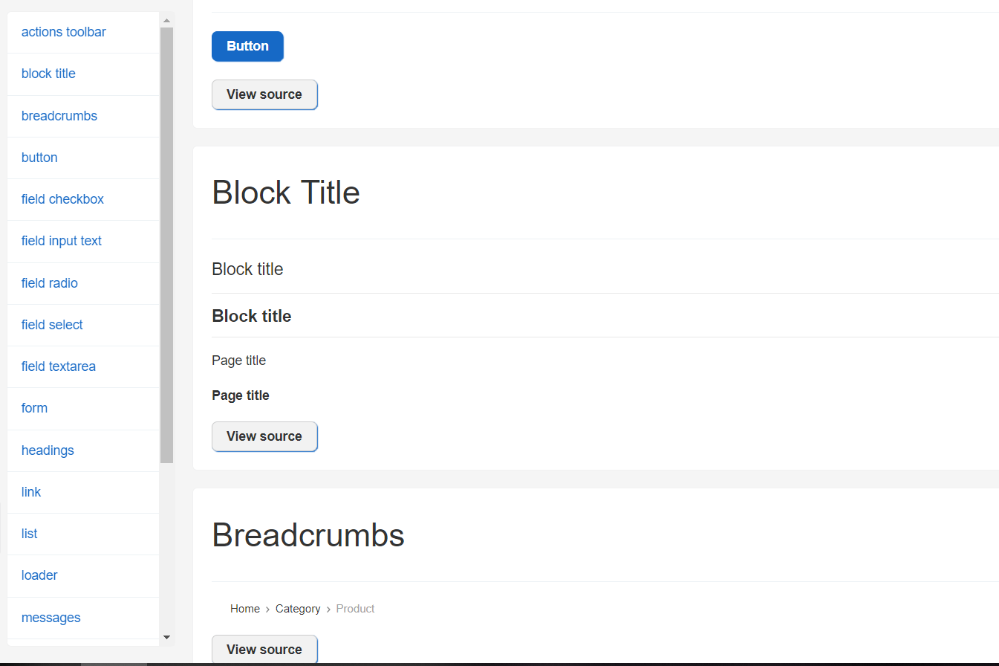
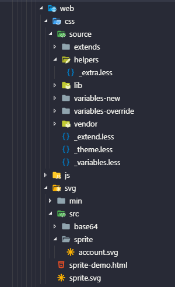

# Theme
```
lib/web
||
Ewave/lego-base
||
Ewave/default
||
Project theme
```
## lib/web
Magento Frontend Library
lib less variable, mixins;(almost no style for component except _modals.less);
js libraries: jquery/ui, underscore, matchMedia, jquery, requirejs, knockoutjs, moment.....

http://magento.local/static/frontend/Ewave/magento/en_US/css/docs/index.html



## Ewave/lego-base
some component style(grid, form..), js widget(slick, backTop, offcavas...)
http://magento.local/static/frontend/Ewave/magento/en_US/css/style-guide/index.html


## Ewave/default
a set of component style
http://magento.local/styleguide (by ewave/styleguide)


## Project Theme
[app/design/frontend/Vendor/themename/]



[web/css/source]
- `_theme.less`: change variables of **lib/web**, **lego-base** and **defaulttheme**;
    - `variables-override/*`
- `_variables.less`: create variables of **project theme**
    - `variables-new/*`
        - `variables-new/generated/_base.less`: generated by `grung svg`
- `_extend.less`: import vendor style or extend/create new component;
    - `vendor/*`
    - `extends/*`
- `helpers/_extra.less`: add style for CMS content;
- `lib/theme/_lib.less`: extend mixin or create mixin;
