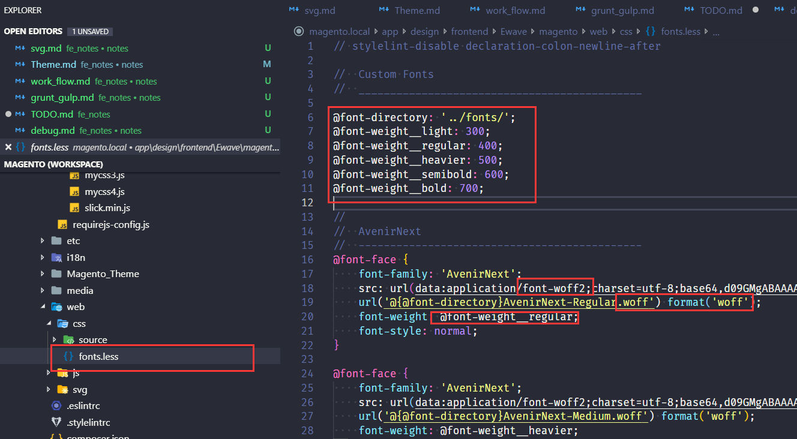

As per font part, you can check this example in the screenshot.
1. create font.less
2. create font-weight variables;
3. generate woff2's base64 content and woff file(for IE11);    (a online tool: https://transfonter.org/)
4. complete font-case as the example

ps. There are cache in localstorage,  font_css_cache and font_css_revision

- change the value `fonts_revision` before git-commit;
```xml
//Magento_Theme\layout\default.xml

<referenceBlock name="js_fonts" >
    <arguments>
        <argument name="fonts_revision" xsi:type="string">1.0.1</argument>
    </arguments>
</referenceBlock>
```