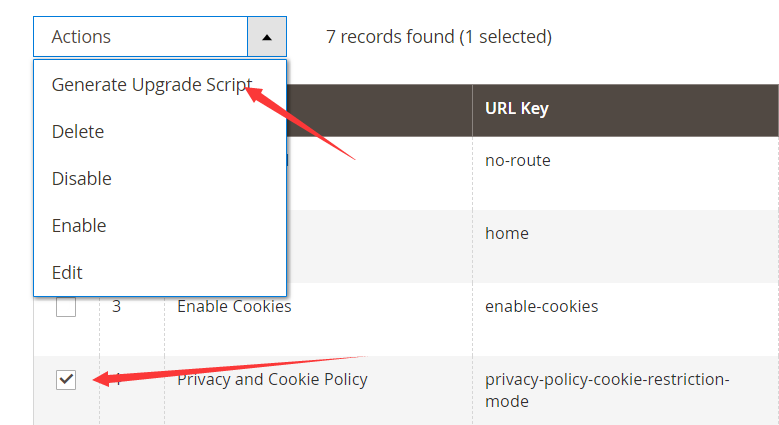
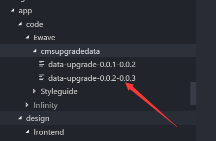

- https://stash.ewave.com/projects/lego

# CmsUpgrade module
Export content of **Block**, **Page**, **Wigets**, **banner**, **store configs** as `\app\code\Ewave\cmsupgradedata\data-upgrade-x.x.x-x.x.y` without media files.

Run `php bin/magento ewave:cms_upgrade` in another enviroment to import above content;
But generally, you don't need to run this command in dev/stag site as it has been contained in depoy_script.

# Styleguide module